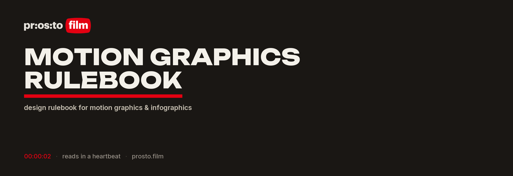
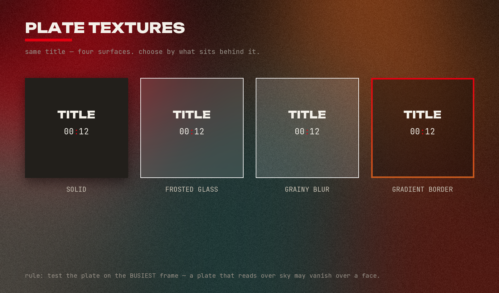
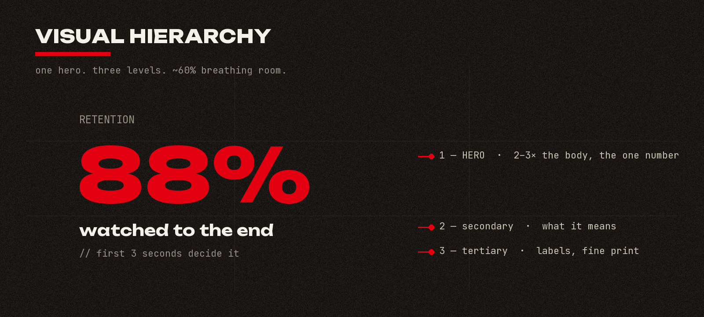
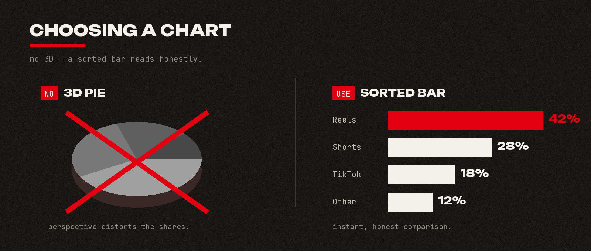
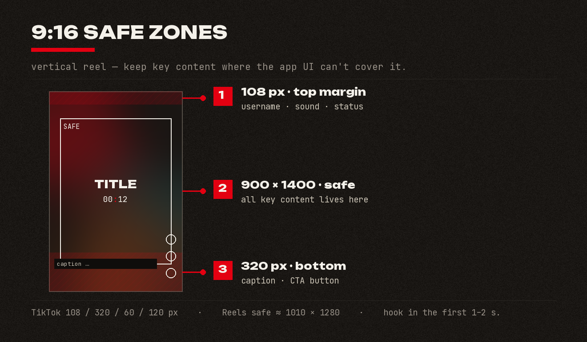
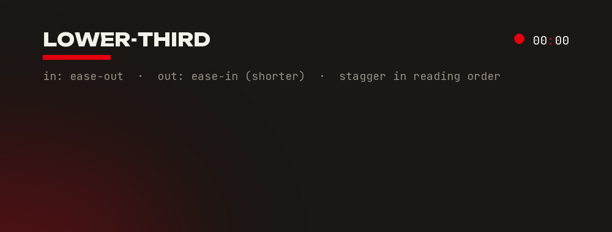

  

**Make on-screen graphics that read in a heartbeat.**

A Claude Code **skill** — the design rulebook for everything that moves on screen: clean infographics, readable
lower-thirds and titles, animated data, explainer sequences and brand reels. It's the *what-makes-it-good*
reference — the motion-design judgment that separates graphics landing in two seconds from the ones people
scroll past. It carries the rules so the work stays fast, legible, and on-brand: visual hierarchy, plate and
surface textures, animation dynamics and easing, transitions, type, colour and safe zones, formats, depth, and
sound. Motion graphics and infographics — end to end.

You decide the design here; you build it with your render tool. A rulebook, not a render engine.

## `00:01` — What it covers

Ten self-contained reference files, loaded on demand:

| Topic | File |
|---|---|
| Infographic layout, visual hierarchy, story structure, full-screen explainers | `references/infographic-layout.md` |
| Element library (callouts, connectors, badges, progress, timelines, counters), chart-choice rules, accent backgrounds | `references/infographic-elements.md` |
| Plate / surface texture catalog — 11 surfaces (glass, grainy-blur, gradient-border, inner-glow, neumorphism, liquid-glass, noise…) + CSS/Remotion recipes | `references/plate-textures.md` |
| Animation dynamics & easing — enter/exit timing, spacing, momentum, overshoot, the 12 principles | `references/animation-dynamics.md` |
| Scene transitions & broadcast bumpers / stings / idents, sound sync | `references/transitions-and-bumpers.md` |
| Typography, colour (60-30-10), safe zones, caption accessibility, motion-safety (flashing) | `references/typography-color-safezones.md` |
| Formats — vertical 9:16 reel safe zones, aspect ratios, render/delivery specs, broadcast-legal levels, seamless loops | `references/formats-and-delivery.md` |
| Faking depth — parallax, z-depth, 2.5D, camera moves, lighting | `references/depth-and-3d.md` |
| Turning a brand into a motion system — signature movement, consistent DNA | `references/motion-branding.md` |
| Finishing — matching the colour grade & grain, sound design for graphics | `references/finishing-grade-and-sound.md` |

`SKILL.md` holds the universal core (the non-negotiables) plus a map telling Claude which reference file to
read for the task at hand.

## `00:02` — Examples

The rules, shown — real graphics built to them (in the Prosto.Film brand).

**Plate / surface textures** — same title, four surfaces; choose by what sits behind it.

**Visual hierarchy** — one hero, three levels, ~60% breathing room.

**Choosing a chart** — no 3D; a sorted bar reads honestly.

**9:16 safe zones** — keep content where the app UI can't cover it.

**Animation — enter & exit** — in on `ease-out`, out on `ease-in` (shorter), staggered in reading order.

## `00:03` — How it works

This is a **rulebook**, not a build engine. It pairs with a separate `motion` skill that handles the actual
Remotion (React video) build & render workflow:

- **`prostofilm-motion-graphics`** (this) — how to *decide* the design.
- **`motion`** — how to *build* it.

Per-client brand (fonts, palette, locked decisions) lives in the client's own folder, never hardcoded here.

## `00:04` — Install

Drop the `prostofilm-motion-graphics/` folder into your skills directory (e.g. `~/.claude/skills/`), or
install the packaged `prostofilm-motion-graphics.skill` file. Claude consults it automatically whenever you
work on infographics, titles, plates, animated data, transitions, or brand reels.

## `00:05` — Sources & originality

All text is an original synthesis written for this pack — see [`SOURCES.md`](SOURCES.md) for the research
consulted and the copyright note (no copied passages, images, fonts, or logos; brand/standard names used only
as nominative factual references).

## `00:06` — License

[MIT](LICENSE) © 2026 Mariya Suranova (Prosto.Film)

---

**Just a film — cinema made simple.** · [prosto.film](https://prosto.film)
